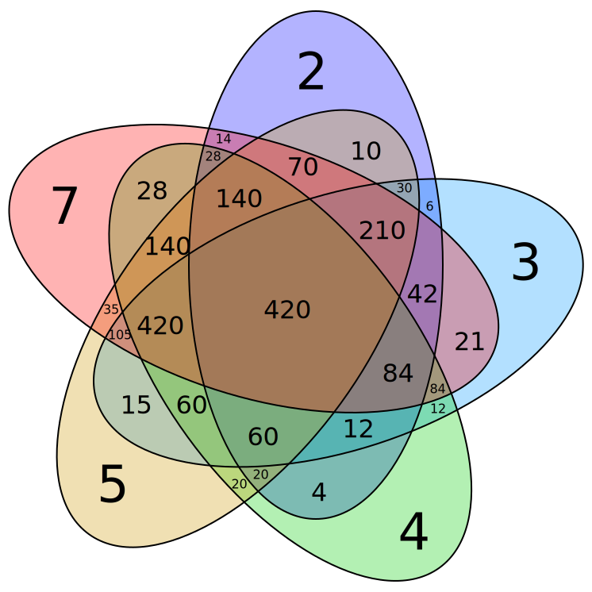

# 最小公倍数

最小公倍数\(least common multiple, LCM\)是指两个或多个[整数](https://baike.baidu.com/item/%E6%95%B4%E6%95%B0/1293937)公有的倍数叫做它们的公倍数，其中除0以外最小的一个公倍数就叫做这几个整数的最小公倍数。

### 公式

求解LCM可以通过两数之乘积的绝对值除以两数的最大公约数，即：

```text
lcm(a, b) = |a * b| / gcd(a, b)
```



### 实现

这里借用上一章节中实现的 `euclideanAlgorithm` 方法：

```javascript
import euclideanAlgorithm from '../euclidean-algorithm/euclideanAlgorithm';

/**
 * @param {number} a
 * @param {number} b
 * @return {number}
 */

export default function leastCommonMultiple(a, b) {
  return ((a === 0) || (b === 0)) ? 0 : Math.abs(a * b) / euclideanAlgorithm(a, b);
}
```

